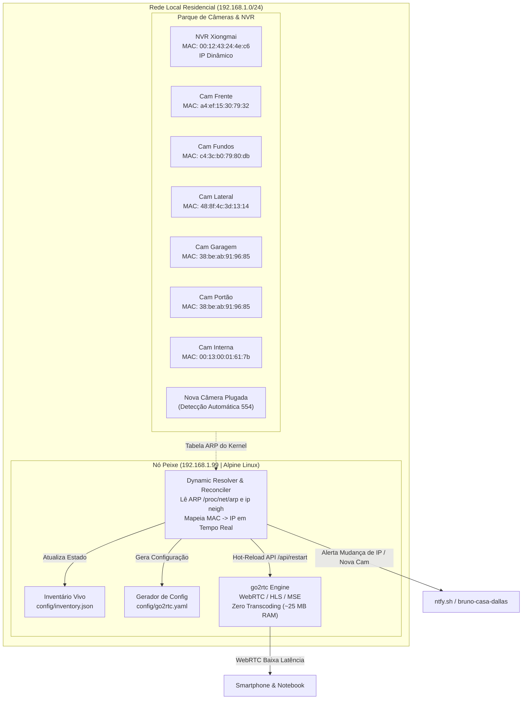

# 🏛️ Arquitetura do Sistema: 10_RTSP_Manager

## 1. Visão Geral e Resiliência de Rede (MAC Address como SSOT)

Em redes locais com DHCP dinâmico, os endereços IP de câmeras e NVRs podem mudar após reinicializações do roteador ou expiração de concessões. O **10_RTSP_Manager** adota o **MAC Address** como Identificador Único Universal (Single Source of Truth) de cada dispositivo.

---

## 2. Mecanismo de Resolução Dinâmica (Reconciliation Loop)

O script [`scripts/dynamic_resolver.py`](file:///home/brunoconter/Documentos/4_HOMELAB/10_RTSP_Manager/scripts/dynamic_resolver.py) atua como um controlador de reconciliação contínua:

1. **Entrada Flexível:**
   * O usuário pode cadastrar um dispositivo por **MAC**, por **IP estático**, ou por **ambos** em `config/cameras.json`.
   * Se informado apenas o IP, o sistema aprende o MAC automaticamente na primeira varredura.
2. **Resolução em Tempo Real:**
   * A cada ciclo, o resolver lê `/proc/net/arp` e `ip neigh`.
   * Envia um ping rápido (1 pacote) para aquecer o cache ARP de hosts em repouso.
   * Identifica o IP atual correspondente a cada MAC cadastrado.
3. **Detecção de Mudança de IP (IP-Change Event):**
   * Se o IP de uma câmera mudar (ex: `192.168.1.4` -> `192.168.1.18`), o sistema:
     1. Registra a mudança no `config/inventory.json`.
     2. Dispara um alerta push via **ntfy** (`bruno-casa-dallas`): `🔄 A Camera_Frente mudou de IP: 192.168.1.4 -> 192.168.1.18`.
     3. Regera o arquivo `config/go2rtc.yaml`.
     4. Envia comando de reload para a API local do `go2rtc` sem derrubar os demais canais!
4. **Descoberta Automática de Novas Câmeras (Hot-Plug):**
   * Qualquer novo dispositivo que surgir na LAN com a porta `554` aberta é catalogado automaticamente como `Discovered_Cam_<IP>` e notificado no celular.

---

## 3. Zero Transcoding (Modo Passthrough) no Raspberry Pi 3

* O hardware do Raspberry Pi 3 (1 GB RAM, ARM Cortex-A53) **não transcodifica vídeo**.
* O `go2rtc` apenas reempacota os pacotes RTP nativos H.264 em WebRTC ou MSE.
* **Consumo de CPU:** Mantém-se abaixo de **1 a 2%** mesmo com 6 câmeras cadastradas.
* **Consumo de RAM:** Estável em **~25 a 30 MB**.
