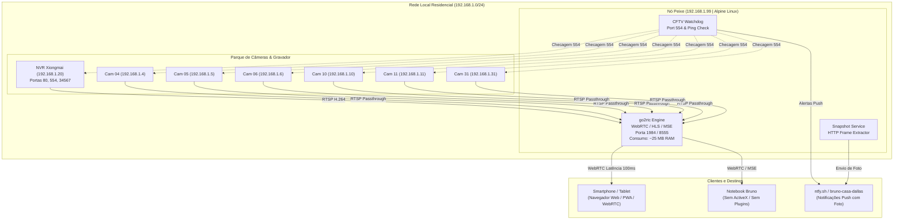

# 🏛️ Arquitetura do Sistema: 10_RTSP_Manager

## 1. Visão Geral

O **10_RTSP_Manager** é uma solução de orquestração de vídeo, monitoramento de saúde de CFTV e gateway WebRTC de baixa latência, projetada especificamente para operar em hardware de recursos limitados (Raspberry Pi 3 Model B, 1 GB RAM, Alpine Linux).

---

## 2. Princípio Fundamental: Zero Transcoding (Modo Passthrough)

### O Problema da CPU no Raspberry Pi 3
* O processador Broadcom BCM2837 (4x Cortex-A53 @ 1.2 GHz) **não possui capacidade de transcodificar vídeo H.264/H.265 via software** para múltiplos canais sem travar e superaquecer o nó.
* Softwares pesados como MotionEye, Shinobi ou Frigate com detecção por CPU consomem 100% dos núcleos e esgotam o 1 GB de RAM.

### A Solução
* As câmeras já entregam os streams comprimidos em **H.264**.
* O **`go2rtc`** funciona como um proxy/multiplexador em memória:
  1. Conecta aos streams RTSP sob demanda.
  2. Reempacota os pacotes RTP nativos diretamente nos protocolos suportados pelos navegadores modernos (**WebRTC** e **MSE/HLS**).
  3. **Zero decodificação e zero recodificação de vídeo**: consumo de CPU permanece abaixo de **1 a 2%**, e a memória RAM não ultrapassa **30 MB**.

---

## 3. Matriz de Portas e Serviços

| Porta | Protocolo | Serviço / Função |
| :--- | :--- | :--- |
| `1984` | HTTP / WS | Painel Web do go2rtc, API REST, WebRTC signaling e snapshots |
| `8554` | RTSP | Servidor de re-streaming RTSP interno |
| `8555` | TCP / UDP | Transporte de mídia WebRTC (baixa latência) |
| `554` | RTSP | Portas de origem do NVR e Câmeras |

---

## 4. Estratégia de Deploy no Nó Peixe

Oferecemos duas abordagens compatíveis:
1. **Nativa via OpenRC (Recomendada para economia máxima):**
   * Binário estático compilado em Go executado como daemon do sistema Alpine (`/usr/local/bin/go2rtc`).
   * Sem overhead de containerização, gerenciado por `rc-service go2rtc start`.
2. **Container Docker Leve:**
   * Utilizando `alexxit/go2rtc:latest` com limites de memória configurados em 64 MB (`deploy.resources.limits.memory: 64M`).
